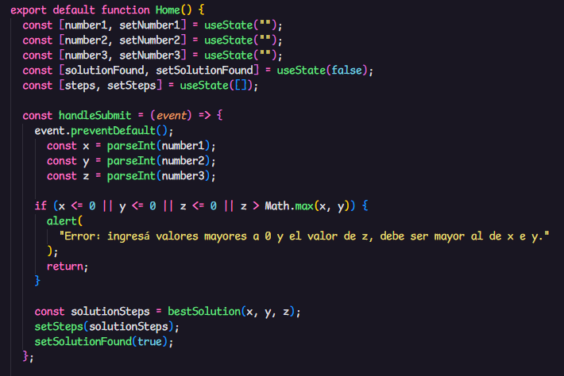
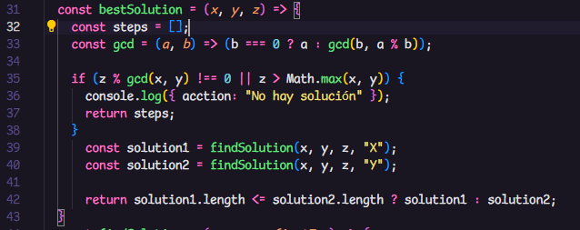

# Challenge Logica
En este proyecto de [CHICKS GOLD LOGICA](https://chicksgold-logica.vercel.app/) desarrolle una solucion para la tarea asignada en el challenge. 

## Logica de la aplicacion 

## Primer función

* Explicación:

Cuando el usuario ingresa los valores de "Número 1" "Número 2" y "Número 3" y luego de presionar el botón "Calcular", la función toma el estado de los valores, los convierte en números enteros y luego de comprobar que los valores son distintos de 0 y el valor de "z" es menor a los valores de "x" e "y" procede a buscar la mejor solucion, si es que existe alguna.

## Segunda funcion 

* Explicación: 

Luego de ejecutarse la primer funcion y que se cumpla la condición, se ejecuta esta segunda función. 
El primer paso que realiza esta funcion es, buscar el minimo común divisor, como condición para poder ejecutar las soluciones. Si no existe, significa que no hay solución posible, porque con los valores dados de "x" e "y", nunca se podrá obtener "z".
Luego de que se cumpla la condición, la función busca la mejor solucion posible, ejecutando la funcion "findSolution", por los dos caminos posibles. Determinando asi, el camino más corto. 

## Tercera funcion 

* Codigo de la funcion : 

const findSolution = (x, y, z, firstTry) => {
  const steps = [];
  let jarraX = 0;
  let jarraY = 0;

    while (jarraX !== z && jarraY !== z) {
      if (firstTry === "X") {
        if (jarraX === 0) {
          jarraX = x;
          steps.push({ jarraX, jarraY, action: "Llenar jarra X" });
        } else if (jarraY === y) {
          jarraY = 0;
          steps.push({ jarraX, jarraY, action: "Vaciar jarra Y" });
        } else {
          const transfer = Math.min(jarraX, y - jarraY);
          jarraX -= transfer;
          jarraY += transfer;
          steps.push({ jarraX, jarraY, action: "Transferir de X a Y" });
        }
      } else {
        if (jarraY === 0) {
          jarraY = y;
          steps.push({ jarraX, jarraY, action: "Llenar jarra Y" });
        } else if (jarraX === x) {
          jarraX = 0;
          steps.push({ jarraX, jarraY, action: "Vaciar jarra X" });
        } else {
          const transfer = Math.min(jarraY, x - jarraX);
          jarraY -= transfer;
          jarraX += transfer;
          steps.push({ jarraX, jarraY, action: "Transferir de Y a X" });
        }
      }

      if (jarraX === z || jarraY === z) {
        break;
      }
    }
  return steps;
  };

* Explicación: 
Esta funcion, toma los valores que ingresa el usuario y recorre los caminos posibles de ambos números "x" o "y". Luego de recorrer esos dos caminos devuelve un resultado. 
Una vez obtenido los dos resultados, la Segunda funcion, es la que compara ambos y decuelve el camino más corto. 